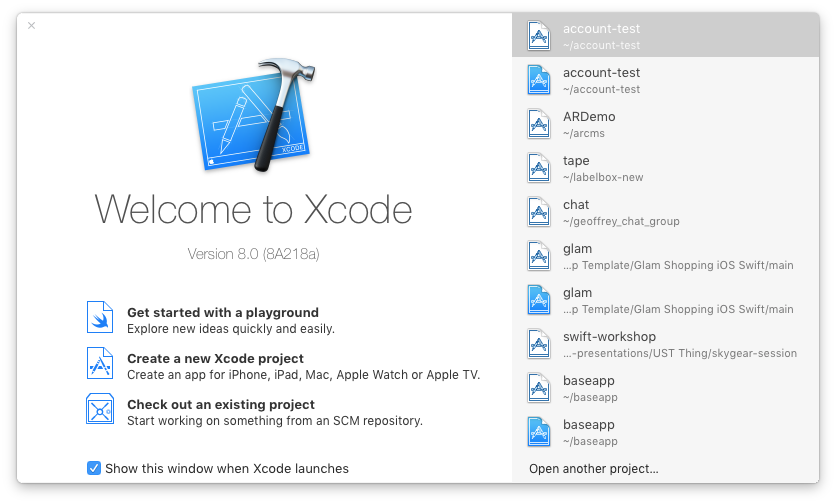
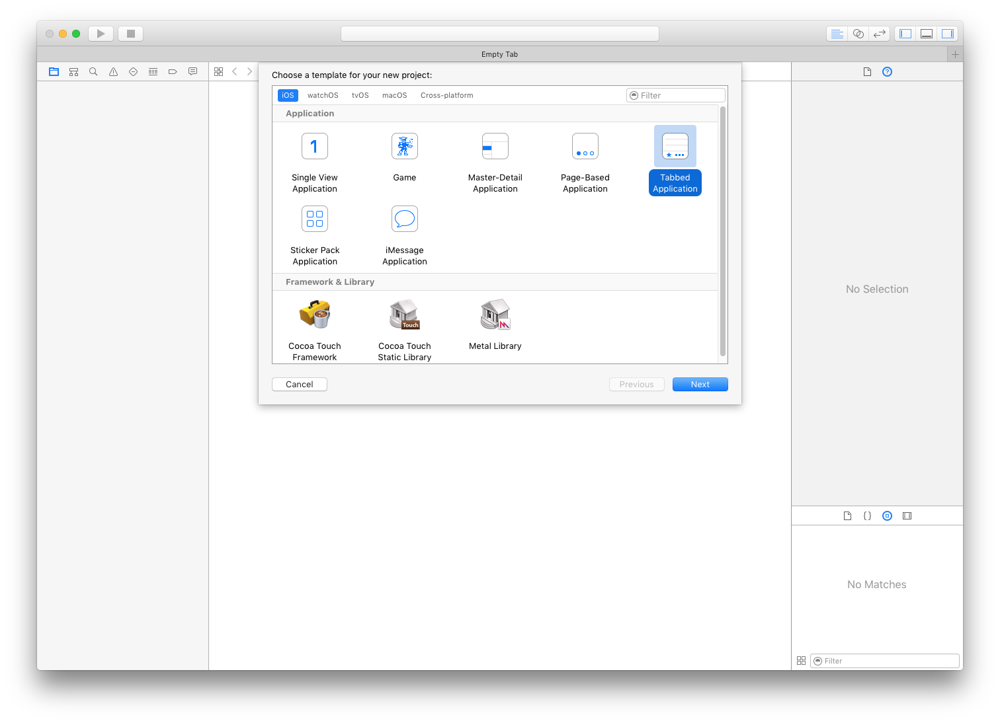
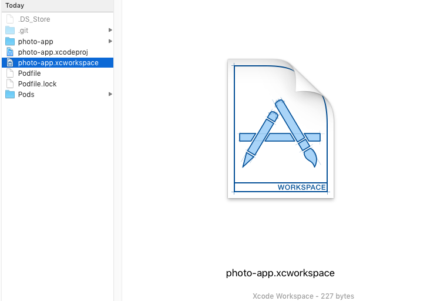
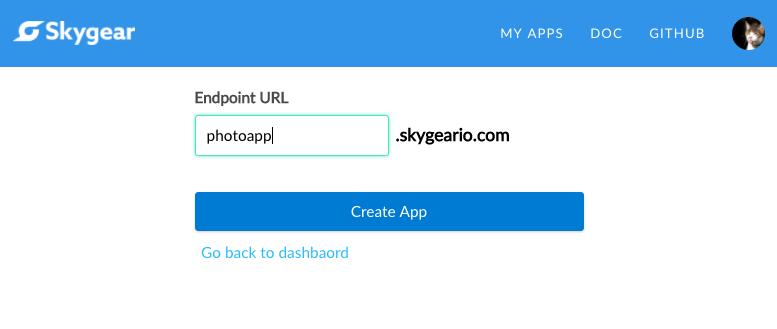
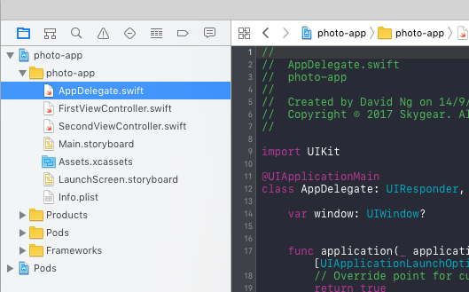
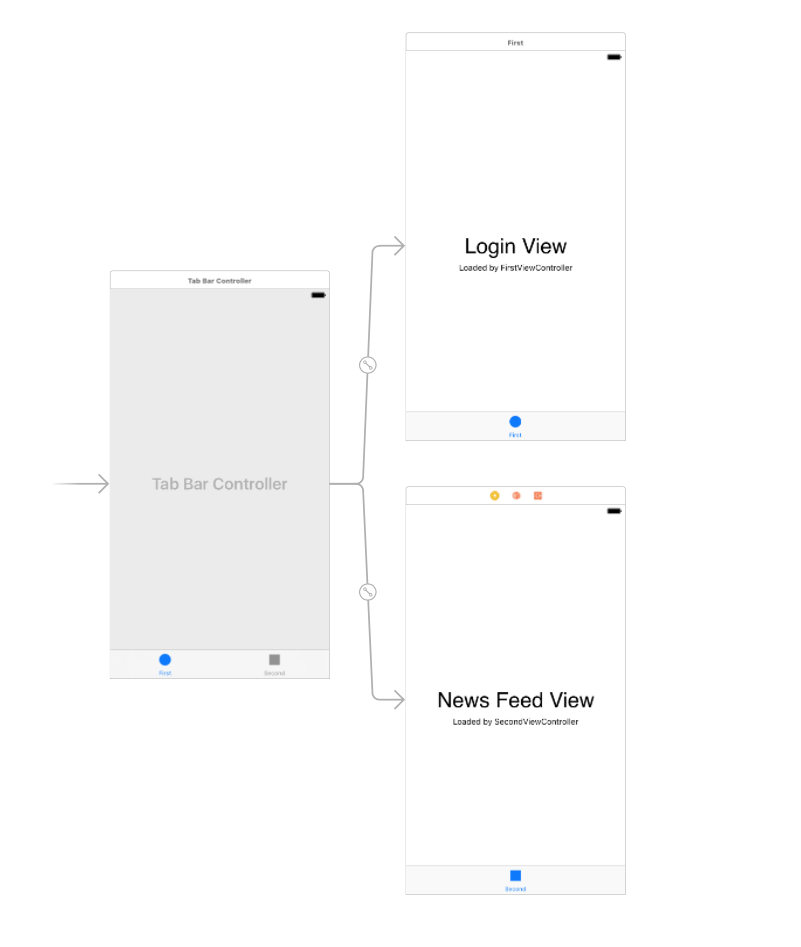

# iOS App in Swift Workshop - Photo App


### About
Building an app that has cloud features (upload files, social interaction, news feed etc.) requires a backend. 

We will use [Skygear](https://skygear.io), an opensoure BaaS platform to build a Instagram-like photo app in a Serverless approach. 

## Part 0 - Concepts

- [Serverless](https://martinfowler.com/articles/serverless.html)

### Cloud Database

What is Skygear? How does Skygear help in this project?

- [Skygear](https://skygear.io) is an open-source backend for mobile and web apps. It takes less effort to build social apps like this photo app.

### SDK

Installing SDK on the client side enables you to access to Skygear APIs easily.

### CocoaPods

- CocoaPods is a dependency manager for Swift and Objective-C Cocoa projects. [Guide for installing CocoaPods](https://guides.cocoapods.org/using/getting-started.html#getting-started) 

- To install required SDK for the project, we make good use of Cocoa Pods.

### Swift

- [Swift API guidelines](https://developer.apple.com/library/content/documentation/Swift/Conceptual/Swift_Programming_Language/TheBasics.html)

e.g.

```swift
let maximumNumberOfLoginAttempts = 10
var currentLoginAttempt = 0
```

```swift
func gameDidEnd (_ game: Game)
```


## Part I - Cloud Feature Basics
1. Open a new xcode project






1. Project setup with CocoaPods
 - Initialize CocoaPods with `pod init`
 - Add `SKYKit` to *Podfile*, now the Podfile looks like this:

 ```
 # Uncomment the next line to define a global platform for your project
 # platform :ios, '9.0'

 target 'swift-workshop' do
  use_frameworks!

   # Pods for swift-workshop
   pod 'SKYKit'

 end
 ```

- Run `pod install`


- **IMPORTANT** After installing the pods, we will work on *swift-workshop.xcworkspace* instead of *swift-workshop.xcodeproj*

Let's open *swift-workshop.xcworkspace*



### Step 0 - Setting Up

1. Setting up the Skygear Server

 - Signup at [portal.skygear.io](portal.skygear.io)
 - Under the **INFO** tab in the portal, you can obtain your Skygear server endpoint and the API Key. You will need them to connect your app to the server

 

1. Initializing the app
 - Skygear iOS Get started Guide: (https://docs.skygear.io/guide/get-started/ios/)[]

 
 
 - Firstly, to use the SDK, import SKYKit in `AppDelegate.swift`

 ```swift
import SKYKit
 ```
 
 - And then, we need to setup the Skygear endpoint and API Key

 ```swift
func application(_ application: UIApplication, didFinishLaunchingWithOptions launchOptions: [UIApplicationLaunchOptionsKey: Any]?) -> Bool {
        // Override point for customization after application launch.        
        SKYContainer.default().configAddress("https://skyphoto.skygeario.com/")
        SKYContainer.default().configure(withAPIKey: "a088e861f541453b9eee0000d44a8810")
        
        return true
    }
 ```  
> If you use this set of api config, you will be able to have some sample posts

* [Skygear Documentation](https://docs.skygear.io) will be helpful for more advanced usage.

### Step 1 - Login

The layout:

 

1. User Signup and Login 
 - We will learn to use `signup(WithUsername: password)` and `login(WithUsername: password)` to do the user authentication.
 - First we will setup the layout (This time we will be very rough)
 - Signup a new account

 ```swift
SKYContainer.default().auth.signup(withEmail: emailField.text!, password: passwordField.text!) { (user, error) in
    if (error != nil) {
        self.showAlert(error as! NSError)
        return
    }
    print("Signed up as: \(user)")
}
 ```

 - Login with existing account

 ```swift
SKYContainer.default().auth.login(withEmail: emailField.text, password: passwordField.text) { (user, error) in
    if (error != nil) {
        self.showAlert(error as! NSError)
        return
    }
    print("Logged in as: \(user)")
}
 ```

 - and of course, logging out the user.

  ```swift
SKYContainer.default().auth.logout { (user, error) in
    if (error != nil) {
        self.showAlert(error as! NSError)
            return
        }
    print("Logged out")
}  
  ```

 - Hint: * We can show an alert when there is something wrong *

 ```
let alert = UIAlertController(title: "Alert", message: "Message", preferredStyle: UIAlertControllerStyle.alert)
alert.addAction(UIAlertAction(title: "Click", style: UIAlertActionStyle.default, handler: nil))
self.present(alert, animated: true, completion: nil)
 ```
 
 - Hint: *If you really care about usability, adding a [loading spinner](https://github.com/SVProgressHUD/SVProgressHUD) would be a nice move.*


 - To check if there exists a current user
`((SKYContainer.default().auth.currentUserRecordID) != nil)`

 - To fetch the current user
 `container.auth.currentUserRecordID`
 `SKYRecordID(recordType: "user", name: value)`

### Step 2 - News feed layout

1. Implementing News feed Layout 
 - We will use `UITableView`, let's create a Table View in the storyboard.
 - Setting up the list we are going to use `var posts = [Any]()`

 - We will use a table view to show the photo feed items. We will make the second view controller the uitabledatasourcedelegate 

### Step 3 - Loading posts

1. Loading and displaying records from the default skygear server 
 - Filling in the data
 - Perform a query on the cloud database

 ```swift
        let publicDB = SKYContainer.default().publicCloudDatabase
        let query = SKYQuery(recordType: "post", predicate: nil)
        let sortDescriptor = NSSortDescriptor(key: "_created_at", ascending: false)
        query.sortDescriptors = [sortDescriptor]
    
        publicDB.perform(query, completionHandler: { posts, error in
            if let error = error {
                print("Error retrieving photos: \(error)")
                self.onCompletion(posts!)
            } else {
                self.onCompletion(posts!)
            }
        })
 ```
 You should be able to see "There are 3 posts" in the console if you implemented onCompletion correctly.
 
 
 ```
     func onCompletion(_ posts:[Any]) {
        print("There are \(posts.count) posts")
        print(posts)
    }
 ```
 
1. Now, we will display the existing items in the tableview

  - There are a few functions in TodoTableViewController we will need to implement:

 `func numberOfSectionsInTableView(tableView: UITableView) -> Int`

 `func tableView(tableView: UITableView, numberOfRowsInSection section: Int) -> Int`

 `func tableView(tableView: UITableView, cellForRowAtIndexPath indexPath: NSIndexPath) -> UITableViewCell`


- Set up the data source
 
 ```
 var posts = [Any]()
 ```

 ```
 self.posts = posts
 ```
 
- In `func tableView(tableView: UITableView, cellForRowAtIndexPath indexPath: NSIndexPath) -> UITableViewCell`, we will return the cell.

 ```
    override func tableView(_ tableView: UITableView, cellForRowAt indexPath: IndexPath) -> UITableViewCell {
        let feedCell = tableView.dequeueReusableCell(withIdentifier: "feedcell", for: indexPath) as! FeedCell
        
        // Configure the cell...
        feedCell.titleLabel.text = "Title"
        feedCell.contentLabel.text = "Content"

        return feedCell
    }

 ```
### Step 4

- Filling in the blanks:

```
    override func tableView(_ tableView: UITableView, cellForRowAt indexPath: IndexPath) -> UITableViewCell {
        let feedCell = tableView.dequeueReusableCell(withIdentifier: "feedcell", for: indexPath) as! FeedCell
        
        // Configure the cell...
        
        let record = self.posts[indexPath.row]
        let post = record as? SKYRecord
        feedCell.titleLabel.text = post?.object(forKey: "title") as? String
        feedCell.contentLabel.text = post?.object(forKey: "content") as? String
        

        return feedCell
    }
```

### Step 5 (The completed project)

### Complete!

Yeah! Then we are done with Part 1.

We learnt how to to:

- Initialize the app (with CocoaPods)
- User Signup and Login
- Edit the storyboard
- Implement News feed Layout
- Query and display data from Skygear cloud database

### Class exercise: 
Can you implement the "Add a new post" feature?

---

## Part 2 - Advanced Cloud Features

In Part 2, we will talk about uploading your photos to the cloud.

We will also do much more beyond simple read / write.


## Before we begin
- Let's make sure your app from the last session is ready, and there is the create new post version works.

### Step 6

### Warm up exercise:
- How to edit an existing post?
 
 ```
 The flow:
  - Update the record in the original record
  - Save it back to the cloud
  - Implement the UI change
 
 ```

### Continue

1. Uploading photos via Skygear 
 - How to pick a photo from iOS?
 - Let's use the `UIImagePickerController`
 
  We will need to extend the `FeedViewController` to implement the interface of `UINavigationCollerDelegate` and `UIImagePickerControllerDelegate`. 
  
  This piece of code is to be pasted outside of the `FeedViewController` class in `FeedViewController.swift`
 
 ```swift
 extension SecondViewController: UINavigationControllerDelegate, UIImagePickerControllerDelegate {
 
 // Add implementation here
 
 }
 ```
 
 To show the Image picker, add the implementation of `presentImagePicker()`:
 
 ```swift
     func presentImagePicker() {
        let imagePicker = UIImagePickerController()
        imagePicker.delegate = self
        imagePicker.modalPresentationStyle = .popover
        imagePicker.allowsEditing = false
        imagePicker.sourceType = .photoLibrary
        present(imagePicker, animated: true, completion: nil)
    }
 ```

 ``` swift
 func imagePickerController(_ picker: UIImagePickerController, didFinishPickingMediaWithInfo info: [String : Any]) {
        let pickedImage = info[UIImagePickerControllerOriginalImage] as? UIImage
        dismiss(animated: true, completion: {
        })
    }
    
 ```

 We can then handle the `pickedImage` 

 NOTE: In iOS10, we will need to add `NSPhotoLibraryUsageDescription` to Info.plist to prompt the user for Photo permission.

 - Prepare to upload the photo

 Imagine one user uploading a photo that is 4K to our server. This is going to take an unreasonable amount of time for uploading, retrieving, and taking up too many space to store. Therefore, before we upload the photo, we have to resize it to a proper size. To do that, we will write a resize function in `PhotoHelper`:

 ```swift
 import UIKit
 import SKYKit

 class PhotoHelper {

    static func resize(image: UIImage, maxWidth: CGFloat, quality: CGFloat = 1.0) -> Data? {
        var actualWidth = image.size.width
        var actualHeight = image.size.height
        let heightRatio = actualHeight / actualWidth

        print("FROM: \(actualWidth)x\(actualHeight) ratio \(heightRatio)")

        if actualWidth > maxWidth {
            actualWidth = maxWidth
            actualHeight = maxWidth * heightRatio
        }

        print("TO: \(actualWidth)x\(actualHeight)")

        let rect = CGRect(x: 0, y: 0, width: actualWidth, height: actualHeight)
        UIGraphicsBeginImageContext(rect.size)
        image.draw(in: rect)
        guard let img = UIGraphicsGetImageFromCurrentImageContext(),
            let imageData = UIImageJPEGRepresentation(img, quality) else {
                return nil
        }

        return imageData
     }
 }
 ```

 To use the resize function in `PhotoHelper`, just call `PhotoHelper.resize()`

 ```
  func imagePickerController(_ picker: UIImagePickerController, didFinishPickingMediaWithInfo info: [String : Any]) {
        if let pickedImage = info[UIImagePickerControllerOriginalImage] as? UIImage,
            let resizedImageData = PhotoHelper.resize(image: pickedImage, maxWidth: 800, quality: 0.9) {
                  }
        dismiss(animated: true, completion: {
        
        })
    }
 ```

### Step 7
 
 - We can upload any files using the [File Assets API](https://docs.skygear.io/guide/cloud-db/data-types/ios/#assets)

We will also put the photo uploading logic inside `PhotoHelper`.
 
 ```
 static func upload(imageData: Data, onCompletion: @escaping (_ uploadedAsset: SKYAsset?) -> Void) {
        guard let asset = SKYAsset(data: imageData) else {
            print("Cannot create SKYAsset")
            onCompletion(nil)
            return
        }

        asset.mimeType = "image/jpg"
        container.uploadAsset(asset, completionHandler: { uploadedAsset, error in
            if let error = error {
                print("Error uploading asset: \(error)")
                onCompletion(nil)
            } else {
                if let uploadedAsset = uploadedAsset {
                    print("Asset uploaded: \(uploadedAsset)")
                    onCompletion(uploadedAsset)
                } else {
                    onCompletion(nil)
                }
            }
        })
    }

 ```


Then we call upload like this:
 
 ```swift
         PhotoHelper.upload(imageData: imageData!, onCompletion: {uploadedAsset in
            if (uploadedAsset != nil) {
                print("has photo")
            } else {   
                print("no photo")
            }  
        })
 ```

 You should be able to get the uploaded `SKYAsset` object, now you need to set it to your post and save it when you upload it.

### Step 8 - Displaying the images

 - How do we get back the image?
 You can access the uploaded asset in the post record

 ```swift
        let imageAsset = post?.object(forKey: "asset") as? SKYAsset
        print(imageAsset?.url)
 ```

1. Displaying image with URL in iOS

 Add an `photoImageView` in the cell, then we update the photo with the URL we got

 ```
		  feedCell.photoImageView.image = UIImage(named: "Placeholder")
        if let imageUrl = imageAsset?.url {
            URLSession.shared.dataTask(with: imageUrl) { data, response, error in
                if let imageData = data {
                    DispatchQueue.main.async {
                        feedCell.photoImageView.image = UIImage(data: imageData)
                    }
                }
                }.resume()
        }

 ```
Optional: To  optimizae the caching and loading speed of the image display, you may consider using some async image downloader library. e.g. [SDWebImage](https://github.com/rs/SDWebImage)

### Step 9 - Filling in Title and content field


### Step 10 - Class exercise

1. Liking a photo 
 - Understanding the record relation

 ```
 User <- Like -> Post

 ```

 > Because this part will mix up with other's data, so I strongly advice you to sign up for a new Skygear account to continue.


1. Tag the photo with geo location 
 - [Geolocation data type](https://docs.skygear.io/guide/cloud-db/data-types/ios/#location)
 - Get the current location

 ```
let locationManager = CLLocationManager()
 ```
 
 - To get a user's current location you need to declare:

 ```
 let locationManager = CLLocationManager()
 In viewDidLoad() you have to instanitate the CLLocationManager class, like this:

 // Ask for Authorisation from the User.
 self.locationManager.requestAlwaysAuthorization() 

 // For use in foreground
 self.locationManager.requestWhenInUseAuthorization()

 if CLLocationManager.locationServicesEnabled() {
    locationManager.delegate = self
    locationManager.desiredAccuracy = kCLLocationAccuracyNearestTenMeters
    locationManager.startUpdatingLocation()
}

 ```
 
 - Then in CLLocationManagerDelegate method you can get user's current location coordinates:

 ```
func locationManager(manager: CLLocationManager, didUpdateLocations locations: [CLLocation]) {
    var locValue:CLLocationCoordinate2D = manager.location.coordinate
    print("locations = \(locValue.latitude) \(locValue.longitude)")
}
 ```

 - Query with location-based questions


### Summary
1. Uploading photos via Skygear 
1. Displaying Image in iOS
1. Liking a photo (Exercise)
1. Tag the photo with geo location (Exercise)
1. Basics in sending Push Notifications


### Take home exercise: 
Implement a self-destruction timer (Photo will automatically distroy after 1 min) 

> Hint: *You can set up a timestamp in the photo record*

#### Appendix:

- Creating Post

```
  let post = SKYRecord(recordType: "post")
        post.setObject("title", forKey: "title" as NSCopying)
        post.setObject("content", forKey: "content" as NSCopying)
        post.setObject(SKYSequence(), forKey: "order" as NSCopying)
                
        SKYContainer.default().publicCloudDatabase.save(post, completion: { (record, error) in
            if (error != nil) {
                print("error saving post: \(error)")
                return
            }
            
            //self.objects.insert(todo, atIndex: 0)
            //let indexPath = NSIndexPath(forRow: 0, inSection: 0)
            //self.tableView.insertRowsAtIndexPaths([indexPath], withRowAnimation: .Automatic)
        })

```